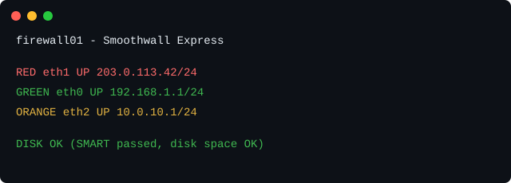

# swe-consolebanner

[](https://github.com/petter5/swe-consolebanner/releases/latest)

A Smoothwall Express 3.1 mod that shows each active firewall zone's device,
link state and IP - plus overall disk health - color-coded, on the physical
console login screen (`/etc/issue`):



(hostname and addresses above are made-up examples, not any real box's)

No more digging through the admin GUI or `ip addr` just to remind yourself
what's plugged into RED/GREEN/ORANGE/PURPLE, or whether the disk is quietly
failing. Because it writes to `/etc/issue`, which `agetty` already displays
automatically right before the login prompt, there's nothing to configure
on the console side - installing the mod is enough.

## Example

If a zone's link is down, its line still shows in that zone's color with
`DOWN` instead of `UP`. Zones with no device configured (e.g. an unused
PURPLE) are omitted - only zones actually in use are shown.

If the disk fails its SMART health check, has a nonzero reallocated/pending
sector or uncorrectable-error count, or any real filesystem is 90%+ full,
the DISK line turns red and names the reason instead, e.g.:

```
DISK     ERROR: SMART FAILED
DISK     ERROR: Reallocated_Sector_Ct=3
DISK     ERROR: Disk full: / 95%
```

## How it works

- `bin/gen-banner.sh` reads `/var/smoothwall/ethernet/settings` for each
  zone's configured device, queries its live link state and IP via `ip`,
  and runs `smartctl` plus `df` for the disk line - then writes the result
  to `/etc/issue`.
- `etc/rc.d/00rc.updatered` hooks Smoothwall's own "run mods' `on RED up`
  scripts" extension point (`rc.updatered`), so the banner refreshes
  whenever RED comes up or its DHCP lease changes.
- `etc/cron.often/gen-console-banner` refreshes it again every ~5 minutes
  as a safety net, for GREEN/ORANGE changes or disk-health changes that
  don't go through `rc.updatered`. Smoothwall's crontab finds mods'
  cron.* hooks with `find /etc /var/smoothwall/mods -regex
  '.*/etc/cron.often'`, but plain `find` doesn't descend into a directory
  reached through a symlink - and `mods/consolebanner` *is* a symlink
  (into `mods-available`), like every mod that follows this install
  pattern. So that `find` would never actually reach
  `mods/consolebanner/etc/cron.often` on its own. `enable-consolebanner`
  works around it with one extra symlink directly under the real
  `/etc/cron.often/`, which the same `find` (started at `/etc`) reaches
  without needing to follow any symlink first.
- No other core files are touched, and no `/etc/inittab`/getty changes
  are needed - `agetty` reads `/etc/issue` by default on every console
  (tty1-6) already.

## Requirements

- Smoothwall Express 3.1
- `smartctl` (from `smartmontools`) for the DISK line. If it's missing,
  the DISK line just reports that instead of silently skipping it.

## Installation

### New install

Smoothwall Express doesn't ship `git`, only `perl` and `curl` - `git
clone` will fail with "no git in ...". Fetch a release tarball instead:

```sh
# On the Smoothwall box, as root:
cd /tmp
curl -sSL -o consolebanner.tar.gz https://github.com/petter5/swe-consolebanner/releases/download/0.1.0/swe-consolebanner-0.1.0.tar.gz
tar xzf consolebanner.tar.gz
mv swe-consolebanner-0.1.0 consolebanner
cd consolebanner
perl enable-consolebanner
```

(If you're doing this from a machine that *does* have git, `git clone
https://github.com/petter5/swe-consolebanner.git consolebanner` into
`/tmp/consolebanner` works identically - `enable-consolebanner` just needs
a directory with `DETAILS` and `bin/gen-banner.sh` in it.)

`enable-consolebanner` copies the mod into
`/var/smoothwall/mods-available/consolebanner`, symlinks it into
`/var/smoothwall/mods`, and generates `/etc/issue` immediately - the
banner is live as soon as the install finishes, no reboot required for
the file's *content* (though consoles that have been sitting at an
already-displayed login prompt since before boot won't refresh their
screen until the next login attempt or reboot - that's `agetty`'s normal
behavior, not specific to this mod).

### Upgrading an existing install

```sh
curl -fsSL -o upgrade.sh https://raw.githubusercontent.com/petter5/swe-consolebanner/master/upgrade.sh
less upgrade.sh   # read it before running anything as root
bash upgrade.sh
```

`enable-consolebanner` is safe to re-run over an existing install - it
overwrites the mod's files in place.

### Uninstalling

```sh
# Disable (keeps the mod files, so it can be re-enabled later):
/var/smoothwall/mods-available/consolebanner/bin/uninstall_consolebanner
# or, equivalently:
perl /var/smoothwall/mods-available/consolebanner/disable-consolebanner

# Fully remove:
rm -rf /var/smoothwall/mods-available/consolebanner
```

Disabling (or uninstalling) also clears `/etc/issue`, so the banner
disappears immediately rather than lingering with stale data.

## License

GPLv3 - see [LICENSE](LICENSE).
